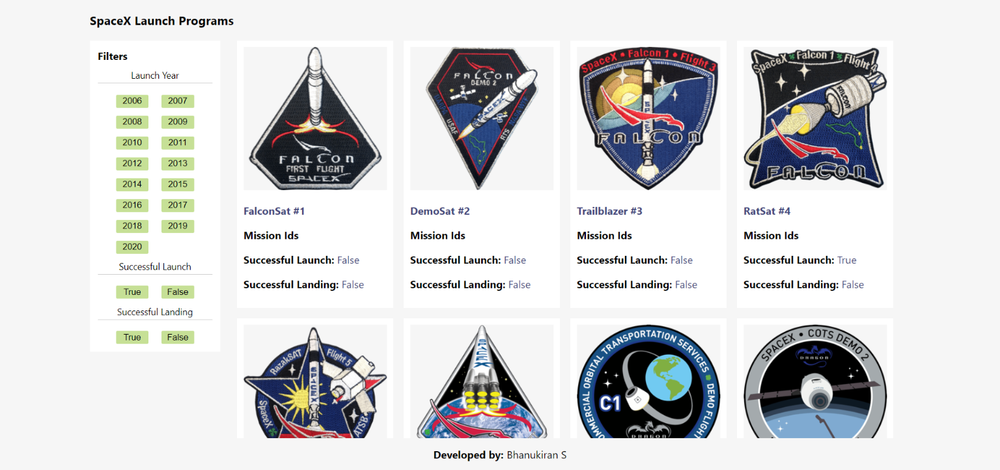
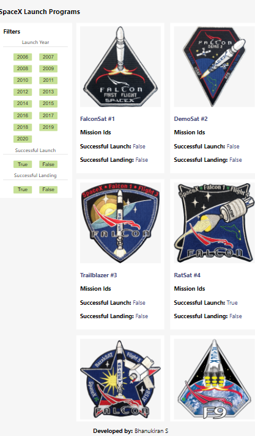
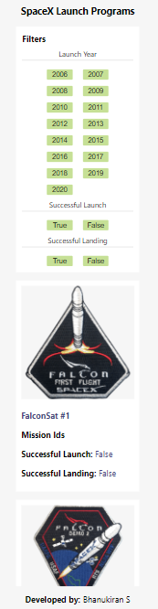
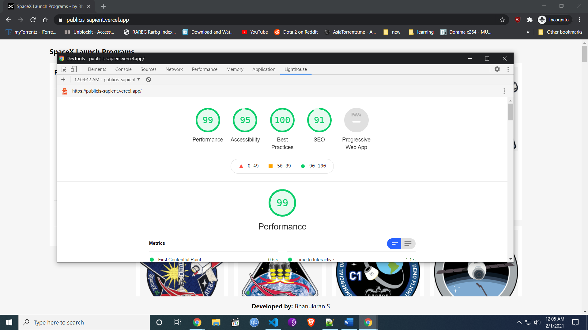

# SpaceX Launch Programs

## Demo: https://publicis-sapient.vercel.app/  

## Tech Stack & Approach

* **NextJs** - for server side rendering
* **React Hooks** - Used useReducer instead of redux since its a small app
* **Axios** - for Apis
* **Css Modules** - for Styling.
* **Vercel** - For deployment. CI - when i push my code to main branch, Vercel will auto deploy.

### Desktop View
**4 Column for products for Desktop View**




### Tablet View
**2 Column for products Tablet View**



### Mobile View
**1 Column for products Mobile View**




### Lighthouse Score
**Best practices for Performance, SEO and Accessibility**



To run the App in local development server:

```bash
npm i && npm run dev
```
Open [http://localhost:3000](http://localhost:3000) with your browser to see the result.

---

Thanks for the opportunity

Thanks & regards,  
Bhanukiran

